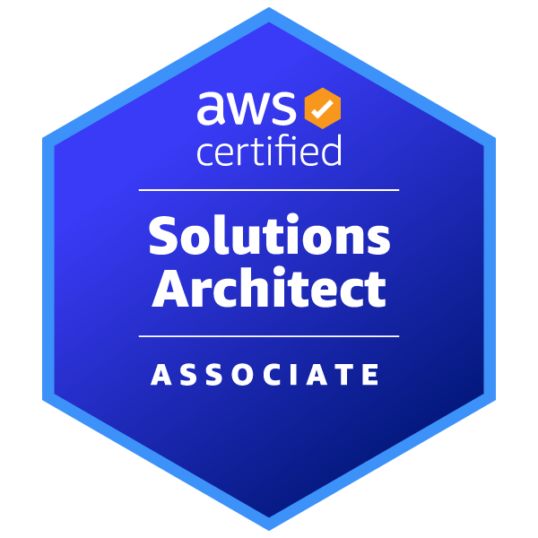

# Jenifer Bisarra

  

AWS Certified Solutions Architect – Associate (SAA-C03)

Cloud & Infrastructure Enthusiast focused on AWS architecture, high availability, monitoring, and operational resiliency.

## Featured Project

- AWS Highly Available Web Solution Architecture with Fault Simulation

## Skills

- AWS Cloud Architecture
- Amazon VPC
- EC2 & Auto Scaling
- Application Load Balancer (ALB)
- Amazon Route 53
- Amazon RDS Multi-AZ
- Amazon CloudWatch
- IAM & Security Groups
- High Availability & Fault Tolerance
- Networking & Subnet Design
- Infrastructure Monitoring
- Linux Fundamentals
- Git & GitHub
- Technical Documentation
- Troubleshooting & Incident Analysis
